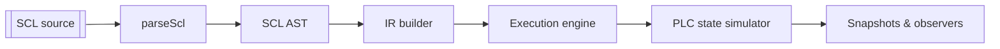
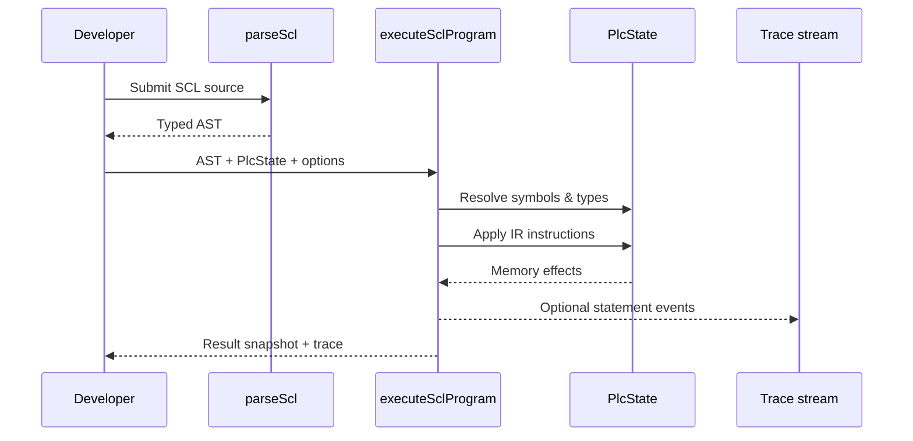

## SCL Emulator

This package wraps the Siemens SCL ANTLR grammar and exposes a strict TypeScript helper for building an abstract syntax tree (AST) from SCL source text. Tooling relies entirely on Node.js (via `antlr-ng` and the `antlr4ng` runtime), so no local Java installation is required.

### Features overview

- SCL parsing: `parseScl` produces a richly typed AST with source ranges for downstream analysis.
- PLC state modelling: `createPlcState` simulates S7 memory areas, optimized data blocks, and type-safe read/write helpers.
- Deterministic execution: `executeSclProgram` builds an intermediate representation (IR) and evaluates it against the PLC state in a single scan.
- Diagnostics and tracing: runtime errors carry precise source locations, while optional tracing surfaces each statement's side effects.
- Tooling pipeline: reproducible Nix shell, codegen scripts, lint/test workflows, and modular docs under `docs/` and `specs/`.

### Architecture



The parser is intentionally decoupled from the execution engine so tooling can inspect or transform the AST prior to evaluation. The PLC state simulator underpins both automated tests and interactive tooling.

### Execution lifecycle



Key extension points include custom PLC initialisation, symbol binding, loop guards, and observers that respond to state mutations.

### Module map

- `src/parser/` — ANTLR-backed lexer/parser utilities plus AST typings and error helpers.
- `src/emulator/` — IR builder, interpreter, error taxonomy, and execution/tracing APIs.
- `src/plc/` — In-memory Siemens S7 state model, observers, snapshotting, and diff helpers.
- `src/index.ts` — Public barrel exporting parser, emulator, and PLC primitives.
- `Siemens-SCL-Antlr-Grammar/` — Upstream grammar tracked as a git submodule for regeneration.
- `docs/` & `specs/` — Architecture notes, emulator walk-throughs, and feature specifications.

### Usage

1. Parse SCL source into an AST with `parseScl`.
2. Initialise a PLC state via `createPlcState`, sizing whichever memory areas your program touches and describing any optimized data blocks.
3. Execute the program by passing the AST, PLC state, and symbol bindings into `executeSclProgram`. Bindings map SCL variable names to PLC addresses (direct such as `M0.0` or data-block paths such as `ProgramState.count`), and optional flags surface tracing or tighten safety guards.

```ts
import { createPlcState, executeSclProgram, parseScl } from "scl-emulator";

const source = `
  FUNCTION_BLOCK Toggle
  VAR
    toggleFlag : BOOL;
  END_VAR
  BEGIN
    toggleFlag := NOT toggleFlag;
    M0.0 := toggleFlag;
  END_FUNCTION_BLOCK
`;

const ast = parseScl(source);
const state = createPlcState({
  flags: { size: 1 },
  optimizedDataBlocks: {
    instances: [{ name: "ProgramState", type: "ProgramState" }],
    types: {
      ProgramState: {
        fields: [{ kind: "scalar", name: "toggleFlag", dataType: "BOOL", defaultValue: false }],
      },
    },
  },
});

const result = executeSclProgram(ast, state, {
  trace: true,
  maxLoopIterations: 100,
  symbols: {
    toggleFlag: "ProgramState.toggleFlag",
  },
});

const flag = state.readBool("M0.0"); // => { ok: true, value: true }
const snapshot = result.snapshot.dbSymbols["ProgramState.toggleFlag"]; // => BOOL write trace
```

Vitest coverage in `tests/emulator/executeSclProgram.spec.ts` demonstrates additional patterns:

- iterative control flow (`WHILE`, `FOR`, `EXIT`, `CONTINUE`) with `maxLoopIterations` guarding infinite loops
- CASE selectors (single values and ranges) targeting outputs like `QB0`
- automatic declaration initialisation and runtime snapshots via `result.trace` when `trace: true`
- explicit error surfaces: `SclEmulatorBuildError` for unsupported statements and `SclEmulatorRuntimeError` when bindings or control-flow usage are invalid

Borrow the fixture in `tests/fixtures/dbDefinitions/emulator.ts` as a reference shape for optimized data blocks when modelling richer programs.

### Regenerating the parser

1. Enter the reproducible environment (run `./shell.sh` directly or inside `./scripts/run-nix-container.sh`). The shell provides Node.js 22 LTS, pnpm, Vitest, and Playwright.
2. Install dependencies with `pnpm install`. This pulls `antlr-ng` and exposes its CLI from `node_modules/.bin` for local use.
3. Regenerate the lexer/parser artifacts when the grammar changes by running `pnpm antlr:generate`. You usually do **not** need to call this manually - `pnpm build`, `pnpm test`, and `pnpm lint` invoke it via their `pre*` hooks so fresh artifacts exist automatically.

Generated files land in `src/generated/` and are intentionally ignored by git. Regenerate after updating `Siemens-SCL-Antlr-Grammar/scl.g4` or when the grammar submodule is rebased.

### Development scripts

- `pnpm build` — regenerates the ANTLR output and compiles TypeScript to `dist/`
- `pnpm test` — regenerates the parser and executes the Vitest suite
- `pnpm lint` — runs ESLint with TypeScript-aware rules

Refer to [01-SPEC-scl-parser](specs/01-SPEC-scl-parser.md) for implementation details and acceptance criteria.
