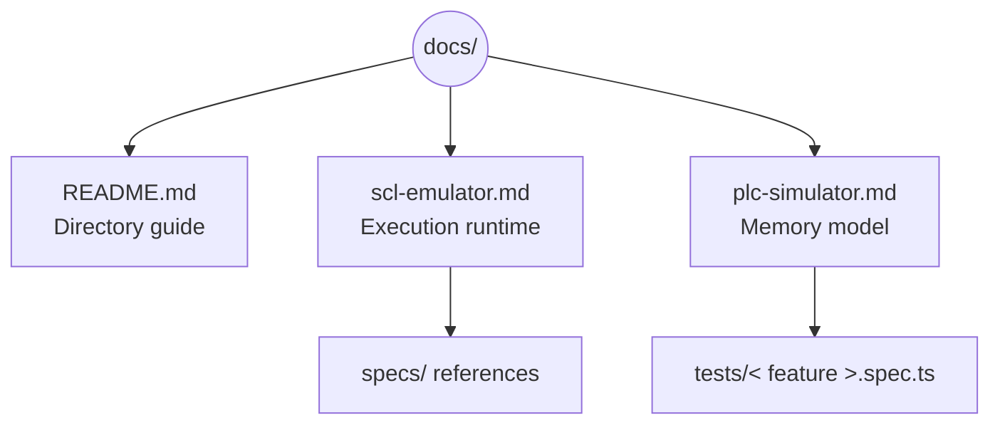

# Documentation

This directory houses user-facing and internal references for the SCL emulator toolkit. Each document focuses on a narrow topic so contributors can link to the relevant material from specs and PRs.

## Document map

- `scl-emulator.md` covers how SCL is interpreted, how the IR is produced, and how tracing works.
- `plc-simulator.md` details the memory layout, addressing rules, and observer APIs.
- Cross-links to `specs/` files capture design rationale and acceptance criteria for future extensions.

Keep diagrams close to their narrative section so contributors can visualise control flow while reading the prose.
