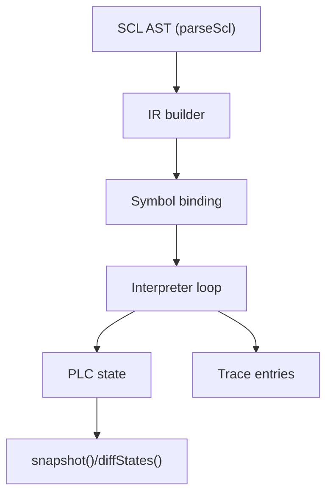
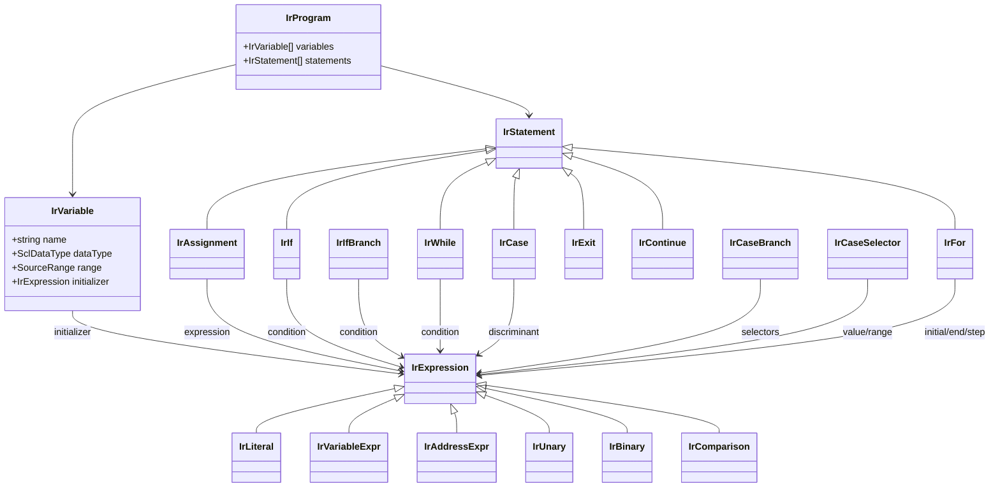
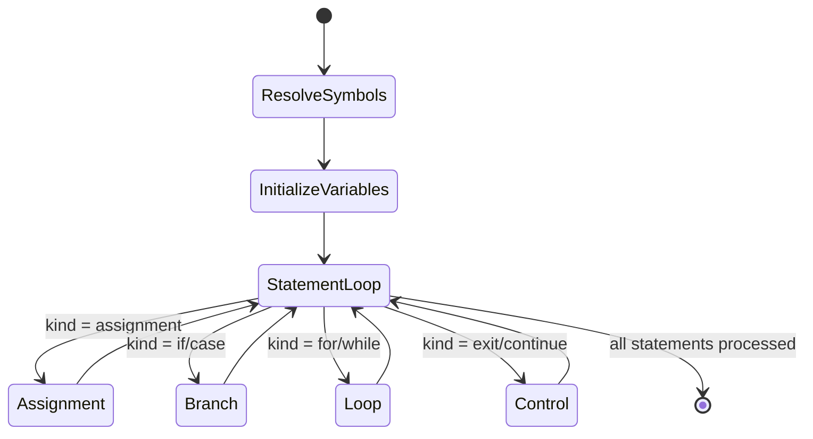

# SCL Emulator

The SCL emulator interprets the Siemens SCL parse tree emitted by `parseScl` and executes a single deterministic scan against the in-memory PLC state implemented in `SPEC-plc-simulator`. The runtime walks the AST, converts it to a small intermediate representation, and drives the PLC via the typed read/write helpers exposed on `PlcState`.

## Pipeline overview



1. `parseScl` emits a typed AST that preserves source ranges for diagnostics.
2. The IR builder normalises declarations, control flow, and expressions into deterministic instruction nodes.
3. Symbol binding maps every declared variable to either a PLC address or an optimized DB symbol before execution begins.
4. The interpreter evaluates statements sequentially, enforcing loop guards and emitting trace entries where requested.
5. Snapshots and diffs expose the PLC memory state to downstream tooling.

## IR structure



Each node carries a `SourceRange` reference so runtime errors can echo precise locations back to developers.

## Supported language surface

- Block types: the first `FUNCTION_BLOCK`, `ORGANIZATION_BLOCK`, `FUNCTION`, or `DATA_BLOCK` body discovered in the AST.
- Statements: assignments, `IF`/`ELSIF`/`ELSE`, `CASE`/`ELSE` (including comma-separated selectors and `a..b` ranges), `WHILE ... DO ... END_WHILE` (guarded by a configurable iteration limit), `FOR` loops with optional `BY` steps, and loop controls `EXIT` / `CONTINUE` within `FOR` or `WHILE` bodies.
- Expressions: variable references, direct addresses (e.g. `M0.0`), optimized DB symbol paths (e.g. `Mixer.rpm`), literals, arithmetic (`+ - * /`), boolean (`AND OR XOR NOT`), and comparisons (`= <> < <= > >=`).
- Data types: `BOOL`, `BYTE`, `WORD`, `DWORD`, `SINT`, `INT`, `DINT`, `LINT`, `REAL`, `LREAL`, `TIME`, `DATE`, `TOD`, and `STRING` when those types are read or written through the PLC state APIs.

Unsupported constructs (e.g. `REPEAT` loops, user-defined TYPE declarations, or array declarations) raise `SclEmulatorBuildError` with the offending source range.

## API

```ts
import {
  analyzeFbSchema,
  createPlcState,
  executeSclProgram,
  parseScl,
  type ExecutionOptions,
} from "scl-emulator";

const source = `
  FUNCTION_BLOCK Toggle
  VAR
    toggleFlag : BOOL;
  END_VAR
  BEGIN
    toggleFlag := NOT toggleFlag;
    M0.0 := toggleFlag;
  END_FUNCTION_BLOCK
`;

const schemaAst = parseScl(`
  FUNCTION_BLOCK ProgramState
  VAR
    toggleFlag : BOOL := FALSE;
  END_VAR
  END_FUNCTION_BLOCK
`);

const schema = analyzeFbSchema(schemaAst);
const ast = parseScl(source);
const plc = createPlcState({
  flags: { size: 1 },
  optimizedDataBlocks: {
    instances: [{ name: "ProgramState", type: "ProgramState" }],
    schema,
  },
});

const options: ExecutionOptions = {
  symbols: {
    toggleFlag: "ProgramState.toggleFlag", // variable-to-symbol binding
  },
  trace: true,
};

const { snapshot, trace } = executeSclProgram(ast, plc, options);
```

- `symbols`: required bindings for declared variables. Supply a canonical FB symbol path or an object `{ address?, symbol?, dataType?, stringLength? }`. When omitted, the declaration’s type is used.
- `addressTypes`: optional overrides for direct addresses when the type cannot be inferred from the literal spelling (e.g. `MD0` → `REAL`).
- `maxLoopIterations`: guard for `WHILE` loops (default `1000`).
- `trace`: when `true`, collects statement-level effects (`address`, `dataType`, `value`).

The return value contains a snapshot of the final PLC memory (`PlcSnapshot`) and, when tracing is enabled, an ordered list of effects executed in that scan.

### Statement evaluation lifecycle



Each handler produces zero or more `ExecutionEffect` records that are buffered when tracing is enabled. Loop handlers honour the configurable `maxLoopIterations` guard before returning control to the main loop.

## Examples

### Increment a flag byte

```ts
const incrementSource = `
  FUNCTION_BLOCK IncrementFlag
  BEGIN
    MB0 := MB0 + 1;
  END_FUNCTION_BLOCK
`;

const incrementAst = parseScl(incrementSource);
const plc = createPlcState({ flags: { size: 2 } });
executeSclProgram(incrementAst, plc, { addressTypes: { MB0: "BYTE" } });
```

### Toggle a retained FB flag

```ts
const toggleSource = `
  FUNCTION_BLOCK Toggle
  VAR
    stored : BOOL;
  END_VAR
  BEGIN
    stored := NOT stored;
  END_FUNCTION_BLOCK
`;

const toggleAst = parseScl(toggleSource);
const retentionSchema = analyzeFbSchema(parseScl(`
  FUNCTION_BLOCK ProgramState
  VAR
    stored : BOOL := FALSE;
  END_VAR
  END_FUNCTION_BLOCK
`));

const plc = createPlcState({
  optimizedDataBlocks: {
    instances: [{ name: "ProgramState", type: "ProgramState" }],
    schema: retentionSchema,
  },
});

executeSclProgram(toggleAst, plc, {
  symbols: { stored: "ProgramState.stored" },
});
```

### Reset a local INT variable when a limit is reached

```ts
const resetSource = `
  FUNCTION_BLOCK ResetCounter
  VAR
    counter : INT;
  END_VAR
  BEGIN
    IF counter >= 10 THEN
      counter := 0;
    ELSE
      counter := counter + 1;
    END_IF;
  END_FUNCTION_BLOCK
`;

const resetAst = parseScl(resetSource);
const counterSchema = analyzeFbSchema(parseScl(`
  FUNCTION_BLOCK ProgramState
  VAR
    counter : INT := 0;
  END_VAR
  END_FUNCTION_BLOCK
`));

const plc = createPlcState({
  optimizedDataBlocks: {
    instances: [{ name: "ProgramState", type: "ProgramState" }],
    schema: counterSchema,
  },
});

executeSclProgram(resetAst, plc, {
  symbols: { counter: "ProgramState.counter" },
});
```

## Limitations & notes

- Only the first block in the AST is executed; multi-block sources require separate invocations.
- Initial values declared via `:=` are applied at the start of each scan. Persisting power-on values is future work.
- Address inference covers common I/Q/M forms; provide `addressTypes` for ambiguous tokens like `MD0`.
- `CASE` selectors accept discrete values and inclusive ranges (e.g., `0..5`).
- `FOR` loops require arithmetic iterators; negative steps are supported via `BY -1`, while `DOWNTO` syntax remains unsupported. `EXIT`/`CONTINUE` are honored inside `FOR` or `WHILE` bodies; using them elsewhere raises an interpreter error.
- Execution is single-cycle; multi-cycle retention semantics or timers/counters remain out-of-scope for this milestone.
