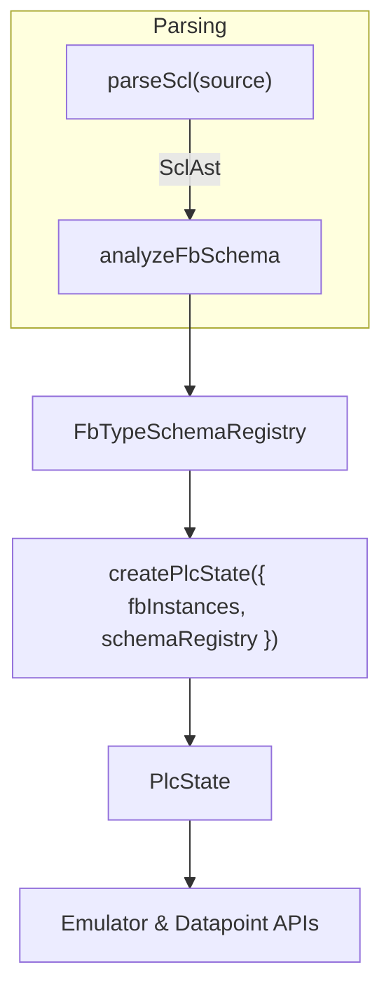

# SPEC-db-symbol-auto-derive

## Status

- Implemented

## Owners

- Codex (Planner-Architect)

## Date

- 2025-10-30

## Summary

- Evolve the symbolic DB implementation so `createPlcState` only requires an FB instance → FB type mapping; the field layout, defaults, and string lengths are auto-derived from parsed SCL sources (AST/IR) with Siemens defaults applied when metadata is missing.

## Context

- [04-SPEC-db-symbolic-addressing](04-SPEC-db-symbolic-addressing.md) replaced absolute DB addresses with symbolic lookups but assumed callers supplied fully-expanded optimized DB schemas. That has proven burdensome for tools already parsing SCL because they must duplicate schema extraction logic.
- The parser (`parseScl`) and IR builder already traverse SCL declarations; we can extend this pipeline to emit reusable FB type schemas that drive PLC state initialization.
- Product wants to minimize manual configuration, accept Siemens defaults (e.g., `STRING` → `STRING[254]` when unspecified), and ensure schemas remain consistent with the source SCL.

## Goals (Acceptance criteria)

- Provide a library API that accepts parsed SCL input (AST or derived schema) and generates FB type symbol definitions covering scalars, arrays, nested structs, and FB multi-instances.
- Update `PlcStateConfig` so consumers supply only FB instance → FB type pairs plus a reference to the extracted schema; manual field-by-field definitions are no longer required.
- Apply Siemens default string length (`STRING[254]`) when declarations omit explicit bounds; keep declared defaults for other scalars.
- Ensure emulator bindings, metadata listing, and tests function unchanged when powered by auto-derived schemas.
- Document migration guidance and examples showing how to generate schemas from SCL and feed them into `createPlcState`.

## Non-goals

- Supporting Siemens UDT/TYPE files beyond those expressible in the existing SCL grammar.
- Inferring defaults for expressions the evaluator cannot currently handle (e.g., complex arithmetic in initializers).
- Replacing the existing AST or IR builder; we only extend them.

## Decision

- Build an `analyzeFbSchema` pass on top of the existing SCL AST that walks FB and multi-instance declarations, producing normalized `FbTypeSchema` objects consumed by `createPlcState`.
- Cache schemas per FB type; `PlcState` now loads schemas by type name when instantiating instances supplied in config, ensuring a single truth source aligned with SCL.
- Default `STRING` lengths to 254 when unspecified, matching Siemens behavior.
- Alternatives considered:
  - **Manual schema authoring (current)**: rejected because it duplicates parser logic for every consumer.
  - **Rely solely on IR variables**: rejected; IR currently only covers the active block and scalars, requiring significant changes and still lacking cross-block context.
  - **Runtime reflection against executed FB code**: rejected for complexity and latency; we need schemas before execution.

## Architecture and Design

- Extend parsing pipeline with a schema extractor:

- **Schema extractor (`analyzeFbSchema`)**
  - Input: `SclAst` and optional base FB type schemas (for multi-file merges).
  - Output: `Map<string, FbTypeSchema>` where each schema enumerates fields (scalars, arrays, structs, nested FB instances) with defaults/string metadata.
  - Handles:
    - Scalar parsing via existing type resolver.
    - Array bounds `(name : ARRAY[0..n] OF <type>)`.
    - Struct-like nested `VAR` blocks / user-defined structures supported by grammar.
    - FB multi-instance declarations.

- **PlcStateConfig changes**
  - `optimizedDataBlocks` becomes `{ instances: Array<{ name: string; type: string }>, schema: FbTypeSchemaRegistry }`.
  - During initialization, `PlcState` resolves type → schema via registry and materializes the optimized DB store as before.

- **Emulator & Metadata**
  - Interpreter symbol resolution reuses registry for type validation.
  - `listFbInstanceSymbols` reads directly from instantiated schemas.

- **API additions**
  - Exported helper `extractFbSchemas(ast: SclAst): FbTypeSchemaRegistry`.
  - Optional helper `buildSchemaFromIr(ir: IrProgram)` for callers that already construct IR.

## Performance and Complexity

- Schema extraction: O(total declarations) per parsed AST; cached per FB type.
- `createPlcState` remains O(total fields) to allocate storage.
- No change to steady-state read/write complexity (O(1) by descriptor lookup).
- Performance budget: schema extraction for 10 FBs x 200 fields completes ≤ 100 ms in Node 20 on the existing Nix dev shell, with ≤ 32 MB peak RSS.

## Compatibility and Platforms

- Target runtime unchanged (Node.js 20, ESM bundle).
- Backward compatibility: introduce migration path where legacy manual schemas are deprecated; throw explicit error if callers still pass `optimizedDataBlocks.fields`.
- Provide feature flag/log for transitional overlap if needed.

## Security, Privacy, and Compliance

- No new external data flows; parsing stays in-process.
- Ensure schema extraction sanitizes identifiers and guards against oversized array bounds to prevent memory abuse.

## Test Plan

- Unit tests for `analyzeFbSchema` covering scalars, arrays, nested structs, multi-instance FBs, default initializers, string default length.
- Integration tests from parse → schema → `createPlcState` → emulator execution.
- Regression suites confirming existing emulator behavior and metadata listings operate with auto-derived schemas.
- Fixture updates using representative SCL snippets; add snapshot tests for schema output.

## Rollout and Monitoring

- Ship behind a minor-version bump with migration notes in `docs/`.
- Emit console warnings when deprecated manual schema config is used (to ease adoption).
- Rollback: revert to previous release; manual schema path remains available during transition.

## Risks and Mitigations

- **Schema extractor misses grammar features** → Add targeted tests and fallback errors pointing to unsupported constructs.
- **Performance regressions on large ASTs** → Cache schemas and profile extraction; optimize hotspots if needed.
- **Incomplete default handling (e.g., expression initializers)** → Document limitations; evaluate expression evaluator follow-up.

## Open Questions

- None at this time. Multi-file schema merging and partial regeneration are explicitly deferred until there is a concrete requirement.

## References

- [04-SPEC-db-symbolic-addressing](04-SPEC-db-symbolic-addressing.md)
- [Siemens SIMATIC STEP 7 Programming: STRING Data Type Defaults](https://support.industry.siemens.com/cs/document/109757618)

## History

- 2025-10-30: Proposed auto-derived schema enhancement.
