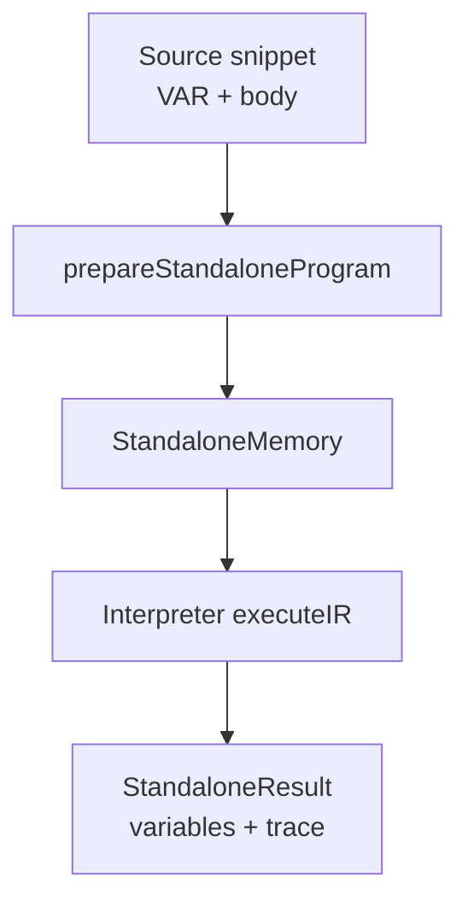

# SPEC-scl-standalone-runner

## Status

- Proposed

## Owners

- Codex (Planner-Architect)

## Date

- 2025-10-31

## Summary

- Define a minimal Siemens SCL execution mode that ingests a snippet containing only `VAR` declarations and a function body, executes it without PLC hardware abstractions, and returns final variable values for inspection.

## Context

- Engineers and users need a quick way to validate SCL control-flow and arithmetic without bootstrapping full PLC blocks or simulator I/O, especially when authoring docs, tests, or tutorials.
- The existing emulator spec ([03-SPEC-scl-emulator](03-SPEC-scl-emulator.md)) assumes integration with a PLC memory model and block headers, which adds overhead for simple snippets and hampers onboarding.
- Providing a standalone runner aligns with upcoming documentation tooling and enables REPL-like experiences for education and regression tests.

## Goals (Acceptance criteria)

- Expose `executeStandaloneScl(source: string, options?: StandaloneOptions): StandaloneResult` within `src/standalone/index.ts` that:
  - Accepts SCL snippets consisting of an optional `VAR`/`END_VAR` section followed by statements.
  - Validates that only scalar variables declared in the snippet are referenced (no external DB, I/O, or system flags).
  - Executes the snippet deterministically using the existing interpreter infrastructure and returns final variable bindings plus optional statement trace.
- Provide a helper `prepareStandaloneProgram(source: string): SclStandaloneProgram` that wraps parsing, minimal semantic checks, and IR generation for reuse in tests.
- Document usage, supported constructs, and limitations in `docs/scl-standalone-runner.md`, showcasing example snippets and variable inspection patterns.
- Add unit and integration tests under `tests/standalone/` that cover:
  - Arithmetic loops (e.g., summing odd numbers) and branching.
  - Type handling for Siemens scalar types supported by the emulator.
  - Error surfaces for undeclared variables, disallowed I/O tokens, and unsupported statements.

## Non-goals

- Emulating PLC cycle timing, hardware I/O, or system flags.
- Supporting arrays, user-defined `TYPE`s, or multi-block projects.
- Providing a full REPL/CLI UI (documentation samples suffice for now).

## Decision

- Reuse the core interpreter by supplying a lightweight `StandaloneMemory` implementation that satisfies the PLC state interfaces using an in-memory map keyed by variable names and data types.
- Synthesize a virtual block wrapper internally during parsing (e.g., `TEMP` block) to conform to existing AST expectations while hiding this detail from users.
- Enforce semantic restrictions during IR build-time to reject constructs outside the standalone scope, ensuring clear diagnostics.
- Alternatives considered:
  - Writing a separate interpreter specialized for standalone snippets: rejected due to duplicated semantics and maintenance overhead.
  - Forcing users to embed snippets inside FB/OB scaffolding: rejected because it contradicts the minimal experience goal.

## Architecture and Design

- `src/standalone/index.ts`: public API exporting `executeStandaloneScl`, option types, and the result model.
- `src/standalone/program.ts`: parses source via `parseScl`, injects virtual block metadata, and produces `SclStandaloneProgram`.
- `src/standalone/memory.ts`: implements `PlcState`-compatible methods backed by a typed variable store.
- Reuse existing IR builder and interpreter; standalone runner configures them with the synthetic context.
- Add fixtures under `tests/fixtures/standalone/` for canonical snippets used across tests.



## Performance and Complexity

- Execution remains O(n) over the number of IR statements executed.
- Target runtime: execute a 200-statement snippet within 50 ms and ≤64 MB RSS on Node.js 20 inside the Nix shell.
- Parser and IR preparation should add <30% overhead relative to emulator baseline.

## Compatibility and Platforms

- Node.js 20.x, TypeScript 5.x strict mode.
- No browser/runtime divergence; API returns plain JSON-compatible data.
- No feature flags required; the API is available once released.

## Security, Privacy, and Compliance

- No external I/O, network, or filesystem access.
- Rejects references to hardware-specific tokens to prevent confusion with real PLC resources.
- Maintains deterministic, sandboxed execution.

## Test Plan

- Vitest unit tests for:
  - Loop control (including `CONTINUE`/`EXIT`) and conditional branches.
  - Type coercion and arithmetic across supported scalar types.
  - Error paths for undeclared variables and disallowed tokens.
- Integration tests running `executeStandaloneScl` on realistic snippets and asserting result maps.
- Coverage target ≥85% across new `src/standalone/` modules and updated interpreter code.

## Rollout and Monitoring

- Released as part of the core library; document usage in the README and spec references.
- Provide migration notes highlighting differences between standalone execution and PLC-backed emulator.
- Rollback by removing `src/standalone/` modules; existing emulator remains unaffected.

## Risks and Mitigations

- **Semantic drift**: Standalone execution diverges from PLC-backed behavior — reuse interpreter and extend tests to cover shared fixtures.
- **Type coverage gaps**: Some Siemens types may lack initialization defaults — implement explicit default constructors and document unsupported types.
- **User confusion**: Developers might expect I/O access — highlight restrictions prominently in docs and error messages.

## Open Questions

- Should we allow callers to supply initial variable bindings (e.g., JSON inputs) instead of relying solely on defaults? _(Owner: Product, due 2025-11-07)_
- Do we need CLI tooling or REPL support in this milestone, or is API + docs sufficient? _(Owner: Product, due 2025-11-14)_

## References

- [03-SPEC-scl-emulator](03-SPEC-scl-emulator.md)

## Appendix: Example Snippet

```
VAR
  index : INT;
  total : INT;
END_VAR

total := 0;
FOR index := 0 TO 5 DO
  IF (index MOD 2) = 0 THEN
    CONTINUE;
  END_IF;
  total := total + index;
END_FOR;
```

## History

- 2025-10-31: Proposed for review.
